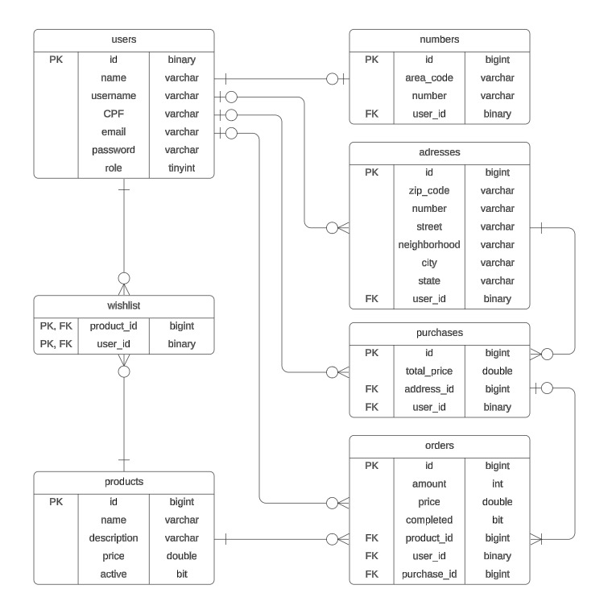
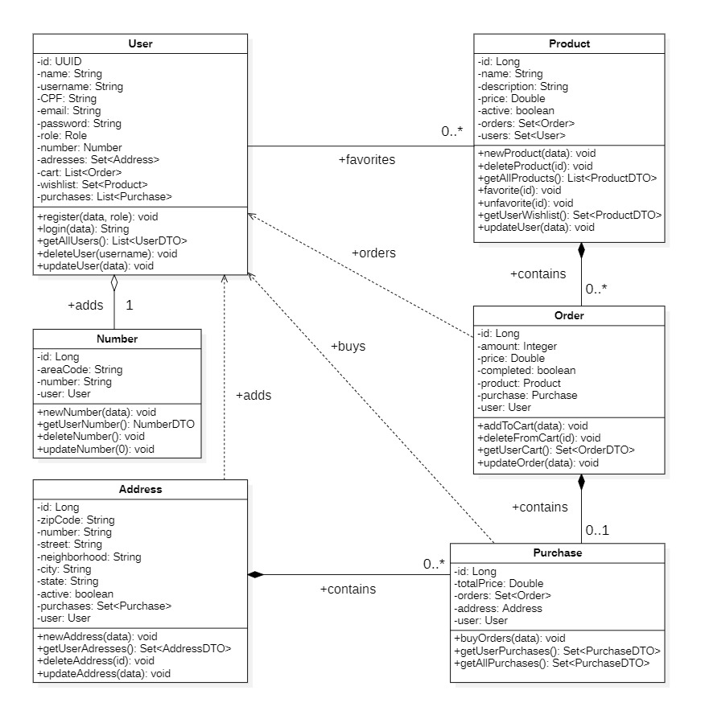

## Ecommerce RestAPI
<p align = "justify">
  This API was developed to manage a ecommerce system, turning the connection between different layers of the application easier. The API goals are enable users to favorite their products, create orders and buy whatever they want to, also they can change their cellphone numbers and shipping adresses! Futhermore, admins can manage users, products and more at the system. Everything with security and guarantee tests.
</p>

### Technologies 📌
- Java Language 17
- Spring Boot 3.2.4
(Web, JPA, Security)
- Token JWT and Bearer Authentication
- JUnit 5 and Mockito
- MySQL Database
- Lombok

### Arrangement 🛠️
#### Download
Before you start, you need to do these steps:
- Versioning Software [Downlaod GIT](https://git-scm.com/downloads)
- Java Language [Download Java SDK](https://www.oracle.com/br/java/technologies/downloads/)
- MySQL Database [Download MySQL](https://dev.mysql.com/downloads/)
- Code Editor IDE [Download Intelij](https://www.jetbrains.com/idea/download/?section=windows)
- Dependency Manager [Download Maven](https://maven.apache.org/download.cgi)
#### Configuration
Then, set the following details:
- Database at 'application.properties'
- Maven as a system enviroment variable
- Set GIT as enviroment variable too

After it, open command prompt and do this:
```bash
# select one of your folders
cd pathone/pathtwo/folder

# clone the repository
git clone https://github.com/pedroxcav/EcommerceAPI.git

# select the project
cd EcommerceAPI

# install all dependencies
mvn install

# test the application
mvn test

# run the application
mvn exec:java
# press (ctrl + c) to stop
```
### Documentation 📄
Information of endpoints and planning the API
#### Endpoints
<details>
  <summary>User Controller</summary>
  
    1. GET /users
    # an admin requires a user list
    
    2. POST /users/
    # registers a common customer user
    
    3. POST /users/admin
    # an admin registers another admin

    4. POST /users/login
    # authenticates the user and token

    5. DELETE /users/{username}
    # an admin removes a user

    6. PUT /users
    # updates the authenticated user
</details>
<details>
  <summary>Product Controller</summary>

    1. GET /products
    # returns a list of products
    
    2. GET /products/me
    returns the user's wishlist

    3. POST /products
    # an admin registers a new product

    4. POST /products/wishlist/{id}
    # favorites any product

    5. DELETE /products/{id}
    # an admin removes a product

    6. DELETE /products/wishlist/{id}
    # unfavorites any product

    7. PUT /products
    #an admin updates a product
</details>
<details>
  <summary>Number Controller</summary>

    1. GET /numbers/me
    # returns the user's cellphone

    2. POST /numbers
    # registers a new user cellphone

    3. DELETE /numbers
    # removes the user's cellphone
    
    4. PUT /numbers
    # updates the cellphone already in
</details>
<details>
  <summary>Address Controller</summary>

    1. GET /adresses/me
    # returns the user's adresses list

    2. POST /adresses
    # registers a new address

    3. DELETE /adresses
    # removes a user's address

    4. PUT /adresses
    # updates the selected address
</details>
<details>
  <summary>Order Controller</summary>

    1. GET /orders/me
    # returns the user's shopping cart

    2. POST /orders
    # creates a new order at the cart

    3. DELETE /orders/{id}
    # removes a order from the cart

    4. PUT /orders
    # updates a order from the cart
</details>
<details>
  <summary>Purchase Controller</summary>

    1. GET /purchases
    # an admin requires a purchase list

    2. GET /purchases/me
    # returns the user's purchase list

    3. POST /purchases
    # the user makes a new purchase
</details>

Your manual tests can be easier with

Postman Collection [Download](https://drive.google.com/file/d/1vyjVJ47zzkK-1Zg9NgT9MyYkOGM-UkIK/view?usp=drive_link)


#### Diagrams
<details>
  <summary>ER Diagram</summary>
  <br>
  
  
</details>
<details>
  <summary>Class Diagram</summary>
  <br>
  
  
</details>

### Autor
Project developed by Pedro Cavalcanti.

Doubts or suggestions, message me here: 

[](https://www.linkedin.com/in/pedroxcav/)
[](https://www.instagram.com/pedroxcav/)
[](mailto:pedroxcav@icloud.com)
